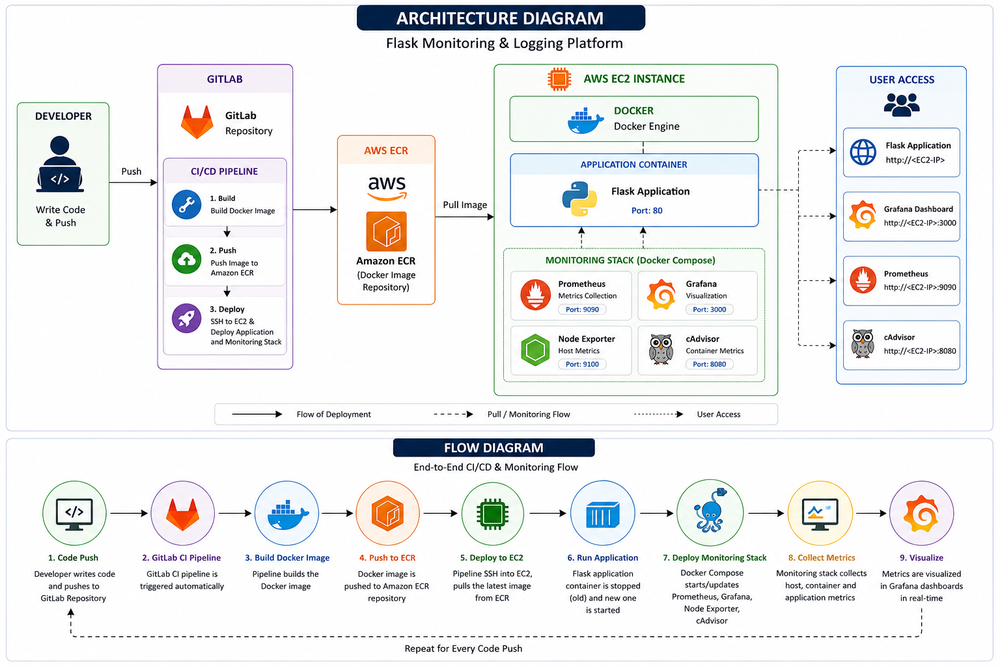

# Flask Monitoring & Logging Platform

<p align="justify"> Designed and implemented a cloud-native Flask monitoring platform with automated CI/CD pipelines using GitLab CI/CD and Docker. Built automated deployment workflows to AWS EC2 through AWS ECR and integrated Prometheus, Grafana, Node Exporter, and cAdvisor for infrastructure, application, and container-level monitoring. Managed monitoring services using Docker Compose and followed Infrastructure as Code practices.</p>

---

## Project Overview

This project demonstrates a complete DevOps workflow including:

- CI/CD pipeline using GitLab
- Dockerized Flask application
- Automated deployments to AWS EC2
- AWS ECR container registry
- Monitoring and observability stack
- Infrastructure as Code practices
- Container and host-level monitoring

The project simulates a real-world deployment pipeline used in modern cloud-native environments.

---

## Architecture Diagram



---

## Tech Stack

| Category | Tools |
|---|---|
| Application | Flask, Python |
| Containerization | Docker |
| CI/CD | GitLab CI/CD |
| Cloud | AWS EC2, AWS ECR |
| Monitoring | Prometheus, Grafana |
| Metrics Exporters | Node Exporter, cAdvisor |
| Infrastructure | Docker Compose |

---

## Features

- Automated Docker image builds
- Image storage using AWS ECR
- Automatic EC2 deployments
- Prometheus metrics scraping
- Grafana dashboard visualization
- Container monitoring with cAdvisor
- Host monitoring with Node Exporter
- Monitoring deployment using Docker Compose

---

## Repository Structure

```bash
flask-monitoring-platform/
│
├── app/
│   ├── app.py
│   ├── requirements.txt
│   └── Dockerfile
│
├── monitoring/
│   ├── docker-compose.yml
│   ├── prometheus.yml
│   └── grafana/
│
├── docs/
│   ├── architecture.png
│   └── flow.png
│
├── screenshots/
│   ├── dashboard.png
│   ├── prometheus-targets.png
│   ├── cadvisor.png
│   ├── pipeline-success.png
│   └── app-homepage.png
│
├── .gitlab-ci.yml
│
└── README.md
```

---

## CI/CD Workflow

**1. Developer Pushes Code**

Code is pushed to the GitLab repository.

**2. GitLab Pipeline Starts**

GitLab CI/CD pipeline automatically triggers.

**3. Docker Image Build**

The Flask application is containerized using Docker.

**4. Push Image to AWS ECR**

The image is tagged and pushed to AWS Elastic Container Registry.

**5. Deploy to EC2**

GitLab Runner SSHs into EC2 and deploys the latest container.

**6. Monitoring Stack Deployment**

Prometheus, Grafana, Node Exporter, and cAdvisor are deployed using Docker Compose.

---

## Monitoring Stack
Component | Purpose |
----------|---------|
Prometheus| Metrics collection
Grafana	Dashboard | Visualization
Node Exporter	| Host-level metrics
cAdvisor |	Container metrics

---

## Monitoring Screenshots

**Grafana Dashboard**


**Prometheus Targets**


**cAdvisor Metrics**


**GitLab Pipeline Success**


---

## Metrics Collected

**Infrastructure Metrics**
- CPU Usage
- Memory Usage
- Disk Utilization
- Network Traffic
- System Load
  
**Container Metrics**
- Container CPU Usage
- Container Memory Usage
- Container Network Usage
- Running Containers
- Container Health
  
**Application Metrics**
- Flask Application Availability
- Request Metrics
- Response Monitoring

---

## Challenges Faced

During the project several real-world DevOps issues were resolved:
- Docker-in-Docker configuration issues
- GitLab Runner image entrypoint conflicts
- EC2 port conflicts on port 80
- GitLab authentication issues on EC2
- Automated monitoring deployment setup
- Docker Compose installation issues

---

## Lessons Learned
- CI/CD pipeline design
- Container lifecycle management
- Monitoring and observability practices
- Infrastructure troubleshooting
- Deployment automation
- Docker networking
- Prometheus metrics collection

---

## Future Improvements
- Kubernetes deployment
- Terraform infrastructure provisioning
- HTTPS with Nginx reverse proxy
- Alertmanager integration
- Loki logging integration
- GitHub Actions implementation
- Auto Scaling deployment

---

## Author
- Sohan Gurav


---

